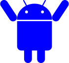

 
# YeetMacro
YeetMacro is a .NET MAUI android app that automates simple but grindy parts of mobile games.

Current target games are:
* Konosuba Fantastic Days
* Eversoul
* Outerplane

This project is heavily influenced by [Fate Grand Automata (FGA)](https://github.com/Fate-Grand-Automata/FGA) and would not have been possible without it.

## ❗ Warning
Please do not use without knowing the risks. The app does randomize tap locations (see [MacroService.cs](https://github.com/kappagacha/yeetmacro2/blob/b5c9a018abb18b0bea1a4b486645f83ba615a269/YeetMacro2/Services/MacroService.cs#L267)) but that does not guarantee that you will not get banned. If you have spent a lot of money on your account, it is recommended that you do not risk it.

## 📓 Setup
### 💻 Emulator
* Android version needs to be at least 9
* Set resolution to 1920x1080 (or 1080x1920 depending on the game)
* Sideload apk file from [latest release](https://github.com/kappagacha/yeetmacro2/releases/tag/latest)

### 📱 Physical Android Device (recommended since games crash often on emulators)
* Depending on game, you can have width or height greater than the target 1920x1080
* (If you cannot meet resolution requirements natively) Set resolution to 1920x1080 (or 1080x1920 depending on the game) using [Resolution Changer - Uses ADB](https://play.google.com/store/apps/details?id=com.draco.resolutionchanger&hl=en_US&gl=US&pli=1)
    * Requires a computer with adb installed and enabling developer mode on the phone
    * Follow the direction of the app
        * [Set up adb on your computer](https://www.xda-developers.com/install-adb-windows-macos-linux/)
        * Connect device to computer
        * Open a command prompt and enter
            * `adb shell pm grant com.draco.resolutionchanger android.permission.WRITE_SECURE_SETTING`
* Sideload apk file from [latest release](https://github.com/kappagacha/yeetmacro2/releases/tag/latest)

### ⬇️ Download a MacroSet
* In YeetMacro app
* Go to Macro Manager Tab
* Tap on Globe icon and choose target game

### 🏃 Running
* Tap on Start
* Allow displaying over screen
* Enable Accessibility for YeetMacro Service
* Tap on play icon on the action overlay
* Choose the script
* Tap play icon on scripts overlay on the lower right

### 🔄 Updating MacroSet
* In YeetMacro app
* Go to Macro Manager Tab
* Tap on Update icon next to MacroSet name

### 🔎 Troubleshooting
* Get help in discord
    * 
* BlueStacks
    * Settings => Graphics => Graphics engine mode => Compatibility

### 💸 If you'd like to support me

